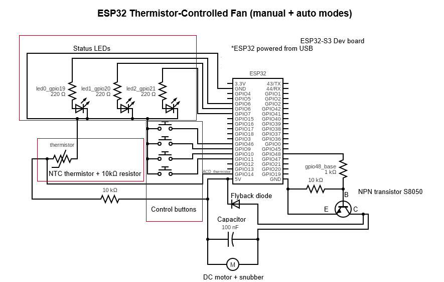
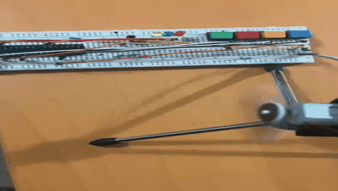
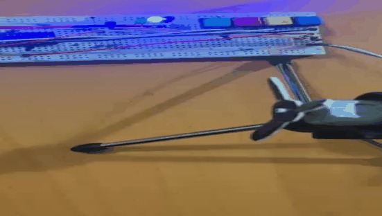
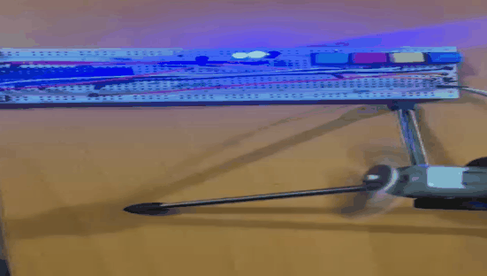

# esp32 thermistor fan automation

Automated fan controller built on ESP32.

The project reads temperature using an NTC thermistor and controls a DC fan
via PWM with soft-start ramping. Supports manual speed control with ±5 duty steps, automatic
temperature-based proportional control, and sensor error detection with LED indicators.

## Features

- NTC thermistor temperature sensing with EMA filtering
- PWM motor control with soft start/stop ramping
- four operating states: OFF, MANUAL, AUTO, ERROR
- manual mode with ±5 duty step control (below min → motor off, above max → clamped)
- auto mode with proportional temperature-to-speed mapping
- three LED indicators: OK (green), AUTO (blue), ERROR (red)
- four-button interface: power, speed up, speed down, auto
- sensor fault detection with automatic recovery
- serial logging for debugging and telemetry

## Hardware

- ESP32
- NTC thermistor
- DC fan motor with driver (MOSFET/H-bridge)
- 3 x LEDs (green, blue, red)
- 4 x push buttons
- resistors
- breadboard and jumper wires

## How it works

1. thermistor ADC value is read and filtered with EMA
2. sensor range is validated (shorted / disconnected detection)
3. in auto mode, fan speed adjusts based on temperature thresholds
4. in manual mode, duty is adjusted ±5 per button press (clamped to min/max)
5. motor PWM ramps gradually to target duty for smooth operation
6. LEDs indicate current state and events

## Controls

| Button | Action |
|--------|--------|
| Power | toggle motor enable/disable |
| Speed Up | increase duty by 5 (manual mode) |
| Speed Down | decrease duty by 5 (manual mode) |
| Auto | toggle auto/manual mode |

## Schema

## Demo

speed change in manual mode, +-5 steps (duty change) 

test auto mode, temperature in the room is low, touching thermistor quickly starting the fan

test error state, after removing one part from the board (in this case thermistor), board going to failed mode showing it with red LED

---

Part of the **embedded-lab** repository.
