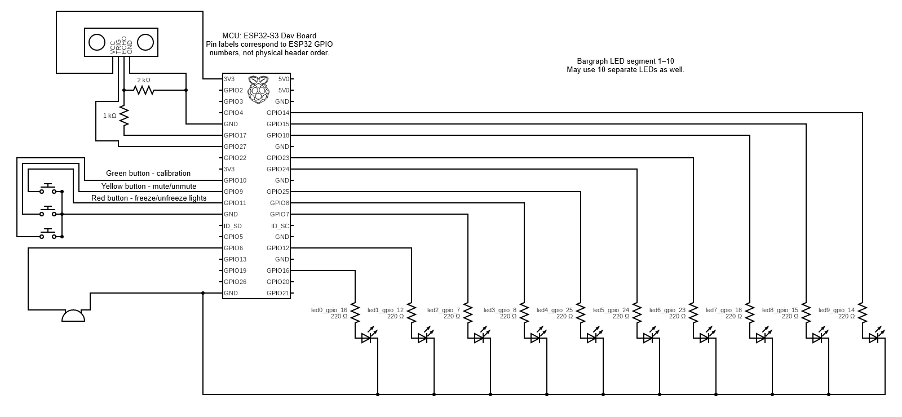

# esp32 ultrasonic distance feedback

Ultrasonic distance indicator built on ESP32.

The project measures distance using an HC-SR04 ultrasonic sensor and provides
real-time visual and audio feedback via a 10-segment LED bargraph and an active buzzer.
Designed as a small embedded system with filtering, calibration, and button-controlled behavior.

## Features

- distance measurement using HC-SR04
- median sampling + exponential smoothing for stable readings
- LED bargraph distance visualization
- active buzzer with distance-dependent beeping rate
- three-button interface:
  - calibration
  - buzzer mute
  - display freeze
- simple state-machine based logic
- designed for 3.3V ESP32 GPIO

## Hardware

- ESP32
- HC-SR04 ultrasonic sensor
- 10-segment LED bargraph
- active buzzer
- 3 × push buttons
- resistors (220Ω)
- breadboard and jumper wires

## How it works

1. ultrasonic sensor measures distance
2. multiple samples are taken, invalid values discarded
3. median value is selected
4. exponential moving average is applied
5. filtered distance is mapped to bargraph level
6. buzzer beeps faster as distance decreases

Calibration allows setting a custom maximum distance.

## Controls

| Button | Action |
|------|--------|
| Red | start / confirm calibration |
| Green | mute / unmute buzzer |
| Yellow | freeze / unfreeze display |

## Demo

## Schema

---

Part of the **embedded-lab** repository.

